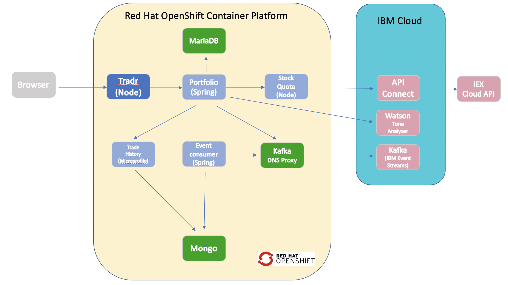

# Stock Trader

The IBM Stock Trader Lite application is a simple stock trading sample where you can create various stock portfolios and add shares of stock to each for a commission.

It keeps track of each porfolio's total value and its loyalty level which affects the commission charged per transaction. It is a simpler version  of the [IBM Stock Trader sample](https://github.com/IBMStockTrader/stocktrader) with fewer microservices designed to run in more resource constrained environments. The HTTPS and JWT security  of the original app have been removed to make  the  deployment configuration simple.

This version is designed to be used for educational purposes on a Red Hat OpneShift CLUSTER. Instructions for deploying the app etc will be included with the educational materials of courses that include this sample.

The **portfolio** microservice sits at the center of the application. This microservice;
* persists trade data  using JDBC to a MariaDB database
* invokes the **stock-quote** service that invokes an API defined in API Connect in the public IBM Cloud to get stock quotes
* invokes the Tone Analyzer service in the public IBM Cloud to analyze the tone of submitted feedback
* sends trades to Kafka so that they can be recorded in Mongo by the **event-consumer** microservice
* calls the **trade-history** service to get aggregated historical trade  data.

**Tradr** is a Node.js UI for the porfolio service

The **event-consumer** service serves as a Kafka consumer and stores trade data published by the portfolio service in the Mongo database.

The **trade-history** service exposes an API to query the historical data in Mongo and is  called by the **portfortio** to get aggregated historical data.

The **stock-quote** service queries an external service to get real time stock quotes via an API Connect proxy.
